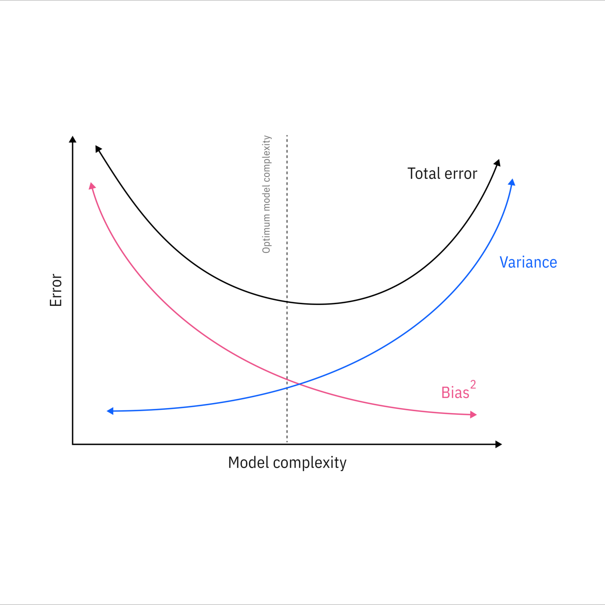
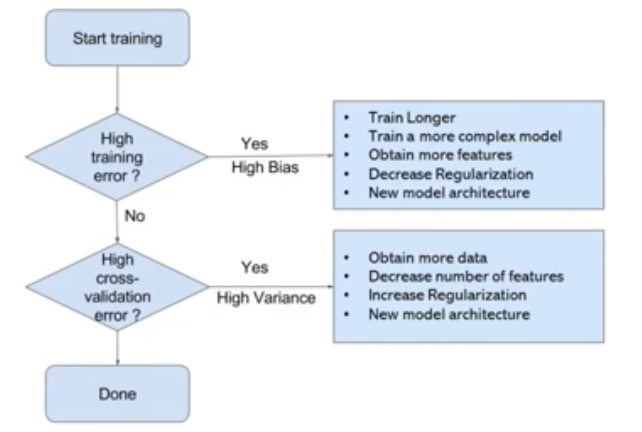

# Overfitting and Underfitting

When training deep learning models, there is a risk of using an algorithm that is too simple to capture the underlying patterns in the data, leading to underfitting, or one that is too complex, leading to overfitting. Managing overfitting and underfitting is a core challenge in data science workflows and developing reliable artificial intelligence (AI) systems.

A model is considered "good" if:

1. It learns patterns effectively from the training data.
1. It generalizes well to new, unseen data.
1. It avoids memorizing the training data (overfitting) or failing to capture relevant patterns (underfitting).

To evaluate how well a model learns and generalizes, we monitor its performance on both the training data and a separate validation or test dataset which is often measured by its accuracy or prediction errors. However, achieving this balance can be challenging. Two common issues that affect a model's performance and generalization ability are overfitting and underfitting. These problems are major contributors to poor performance in machine learning models. Let's us understand what they are and how they contribute to ML models.

## Bias vs Variance Trade-off

**Bias**: It is the error that happens when a machine learning model is too simple and doesn't learn enough details from the data.

- These assumptions make the model easier to train but may prevent it from capturing the underlying complexities of the data.
- High bias typically leads to underfitting, where the model performs poorly on both training and testing data because it fails to learn enough from the data.
- Example: A linear regression model applied to a dataset with a non-linear relationship.

**Variance**: It is the error that happens when a machine learning model learns too much from the data, including random noise, i.e., it is too sensitive to fluctuations.

- A high-variance model learns not only the patterns but also the noise in the training data, which leads to poor generalization on unseen data.
- High variance typically leads to overfitting, where the model performs well on training data but poorly on testing data.

The bias-variance tradeoff is central to addressing underfitting and overfitting and key to achieve optimal performance in a model.

Using a linear regression model for data with a quadratic relationship will result in underfitting because the linear model cannot capture the inherent curvature. As a result, the model performs poorly on the training set and unseen test data because it cannot generalize well to new data.

Generalization is the model's ability to understand and apply learned patterns to unseen data. Models with low variance also tend to underfit as they are too simple to capture complex patterns. However, low-bias models might overfit if they are too flexible.

High variance indicates that the model might capture noise, idiosyncrasies and random details within the training data. High-variance models are overly flexible, resulting in low training error, but when tested on new data, the learned patterns fail to generalize, leading to high test error.

## Overfitting

Overfitting happens when a model learns too much from the training data, including details that don’t matter (like noise or outliers). As a result, the model works great on training data but fails when tested on new data.

For example, imagine fitting a very complicated curve to a set of points. The curve will go through every point, but it won’t represent the actual pattern.

### The reasons for overfitting a model

- High variance and low bias.
- The model is too complex.
- A small training dataset or a noisy dataset.

### The signs of an overfitted model

- When looking at the plot of training and testing loss, the training loss decreases toward zero while validation loss increases, indicating poor generalization.
- The decision boundary (the model's learned rules for classifiying data points) is overly complex and erratic in an overfit model, as it adapts to noise in the training set rather than capturing true underlying structures, further indicating overfitting.

### How to avoid overfitting

#### Regularization

Regularization for regression models or dropout in neural networks, is a technique used in machine learning by discouraging the model from relying too heavily on any single feature or from fitting noise in the training data. Regularization helps the model focus on the underlying patterns rather than memorizing the data.

Common types of regularization include L1, which encourages sparsity by shrinking some coefficients to zero and L2, which reduces the size of all coefficients to make the model simpler and more generalizable.

Things to know about dropout:

- Training is 2-3x slower.
- Use 10-100x learning rate.
- Use high momentum of 0.95 - 0.99
- Use max-norm regularisation.
- Dropout rate(p) should be:
  - Hidden layers: 0.5 - 0.8
  - Input layer: >= 0.8

#### Batch Normalisation

Batch norm is similar to regularisation in the sense that it multiples each hidden unit by a random value at each step of training. In this case, the hidden value is the standard deviation of all the hidden units in the minibatch. Because different examples are choosen for inclusion in the minibatch at each step, the std dev randomly flucuates.

Batch norm also subtracts a random value(mean of the mini batch) from each hidden unit at each step.

Both of these sources of noise mean that every layer has to learn to be robust to a lot of variation in its input, just like with dropout.

#### Gather more data

- Data augmentation is another effective strategy, especially in tasks such as computer vision, where artificially expanding the training data by flipping, rotating or cropping images helps the model generalize better. Simplifying the model by reducing the number of parameters or layers in a neural network also limits its ability to memorize training data details.
- Collect more data
- Synthesise more data

#### K-fold cross-validation

K-fold cross-validation splits the data into subsets, trains on some and tests on the remaining and this process helps with evaluating the model generalisation.

Similarly, engineers can use a holdout set, information from the training set to be reserved as unseen data to provide another means to assess generalization performance. The results are then averaged to provide an overall performance score.

#### Evaluation frameworks

Robust model evaluation frameworks are essential for ensuring that a machine learning model generalizes well. One advanced evaluation technique is nested cross-validation, which is particularly useful for hyperparameter tuning. In nested cross-validation, an outer loop splits the data into training and testing subsets to evaluate the model’s generalization ability.

At the same time, an inner loop performs hyperparameter tuning on the training data to help ensure that the tuning process does not overfit the validation set. This approach separates hyperparameter optimization from model evaluation, providing a more accurate estimate of the model's performance on unseen data.

Another effective framework combines train-test splits with early stopping to monitor validation loss during training. By evaluating the model's performance on a dedicated validation set, engineers can halt training when validation performance plateaus or degrades, preventing overfitting.

Evaluation frameworks should include stratified sampling for classification problems with imbalanced data sets to help ensure that each data split maintains the same class distribution as the original data set. This prevents overfitting to majority classes while providing a fair assessment of the performance of minority classes.

#### Ensemble methods

Ensemble methods, such as bagging and boosting, combine multiple models to mitigate individual weaknesses and improve overall generalization. For instance, random forests, a popular ensemble technique, reduces overfitting by aggregating predictions from multiple decision trees, effectively balancing bias and variance.

## Underfitting

Uderfitting happens when a model is too simple to capture what’s going on in the data. The model doesn’t work well on either the training or testing data.

For example, imagine drawing a straight line to fit points that actually follow a curve. The line misses most of the pattern.

### The reasons for underfitting a model

- The model is too simple, so it probably doesn't represent the complexities in the data.
- The input features which are used to train the model are not adequate representations of underlying factors influencing the target variable.
- The size of the training dataset used is not enough.
- Excessive regularization are used to prevent the overfitting, which constraint the model to capture the data well.
- Features are not scaled or preprocessed inadequetely.
- Insufficient training time.

### The signs of an underfitted model

- Consistently poor performance across both data sets.
- Underfit models also tend to show high errors in learning curves, return suboptimal evaluation metrics and exhibit systematic residual patterns, all of which indicate an inability to learn the underlying relationships in the data effectively.

### How to avoid underfitting

#### More complex models

Increase the model’s complexity to better capture the underlying patterns in the data. For instance, switching from simple linear regression to a polynomial regression can help in cases where the relationship features and the target variable are nonlinear.

While more complex models can address underfitting, they risk overfitting if not regularized properly.  

#### Reducing regularization

Reducing regularization penalties can also allow the model more flexibility to fit the data without being overly constrained. For example, L1 and L2 parameters are types of regularization used to check the complexity of a model. L1 (lasso) adds a penalty to encourage the model to select only the most important features. L2 (ridge) helps lead the model to a more evenly distributed importance across features.

#### Feature engineering

Feature engineering and selection play a role in creating or transforming features—such as adding interaction terms, polynomial features or encoding categorical variables—to provide the model with more relevant information.

#### Training time

Allowing the model more training time by increasing the number of epochs helps ensure that it has an adequate opportunity to learn from the data. An epoch represents one complete pass through the training data set and multiple epochs allow the model to learn patterns more effectively.

Multiple epochs are often used to allow the model to learn patterns in the data more effectively. Also, increasing the size of the training data set helps the model identify more diverse patterns, reducing the risk of oversimplification and improving generalization.

#### Data quality

Holistically, engineers should thoroughly assess training data for accuracy, completeness and consistency, cross-verifying it against reliable sources to address any discrepancies. Techniques such as normalization (scaling values between 0 and 1) or standardization (scaling to a mean of 0 and standard deviation of 1) help ensure that the model does not favor certain variables over others due to differing scales.

## Achieving the optimal model fit

A good model fit lies at the optimal balance between underfitting and overfitting. It describes a model that accurately captures the underlying patterns in the data without being overly sensitive to noise or random fluctuations.

- The tradeoff between model complexity and generalization is about finding the right balance between a model being too simple or too complex.
- Engineers must balance bias and variance to achieve optimal model performance. One way to do this is by tracking learning curves, which will show training and validation errors over time.
- Analyzing validation metrics such as accuracy, precision, recall or mean squared error helps evaluate how well the model generalizes to unseen data.
- A good fit model carefully balances model complexity, training data and regularization techniques to generalize well to new data and provide accurate predictions.

## Process of training a model

## Sources

<https://www.geeksforgeeks.org/machine-learning/underfitting-and-overfitting-in-machine-learning/>

<https://www.ibm.com/think/topics/overfitting-vs-underfitting>
